# 🧬 Demystify Savant: An Open Science Project on Savant Syndrome and FNC Theory


[](https://doi.org/)
[](https://creativecommons.org/licenses/by/4.0/)


**Reframing savant syndrome as differential Field access — not deficit, but alternative tuning**

> 🧬 **Applied FNC Research** | First genomic-level analysis of savant syndrome through FNC lens  
> Part of the [**Applied Philosophy of AI**](https://github.com/bjornshomelab/Applied-Ai-Philoaophy-) research ecosystem  
> **Author:** Björn Wikström | **Version:** 1.0.0 | **Updated:** December 2025

---

## 🏗️ The FNC Interpretation of Savant Syndrome

```mermaid
graph TB
    subgraph Field["🌐 FIELD — Relational Information Structures"]
        F1[Harmonic Ratios<br/>1:2, 2:3, 3:4...]
        F2[Geometric Invariants<br/>Fractals, Symmetry]
        F3[Temporal Patterns<br/>Calendar Regularities]
        F4[Mathematical Structures<br/>Primes, Constants]
    end
    
    subgraph Node["🧠 NODE — Biological Tuning System"]
        direction LR
        N1[Left Hemisphere<br/>Consensus Filter]
        N2[Right Hemisphere<br/>Pattern Detection]
    end
    
    subgraph Cockpit["🎛️ COCKPIT — Subjective Experience"]
        C1["'I just see it'"]
        C2["'The answer appears'"]
        C3["'It was always there'"]
    end
    
    Field -->|Typical Brain:<br/>Filtered Access| Node
    Field -->|Savant Brain:<br/>Direct Access| Node
    Node -->|Renders| Cockpit
    
    style Field fill:#e3f2fd,stroke:#1976d2,stroke-width:2px
    style Node fill:#fff3e0,stroke:#f57c00,stroke-width:2px
    style Cockpit fill:#f3e5f5,stroke:#7b1fa2,stroke-width:2px
```



> 💡 **Core Insight**: Savant abilities arise when the Node (brain) accesses Field structures that are normally filtered out. The patterns pre-exist; savants gain *access*, not *generation*.

---

## 🎯 Project Mission

This project applies the **Field-Node-Cockpit (FNC) framework** to savant syndrome, proposing that:

1. **Savant abilities are not compensatory** — they represent differential access to pre-existing information structures
2. **Instant emergence is expected** — accessed patterns require no learning because they pre-exist
3. **Convergent methods across savants** — independent individuals access the *same* Field structures
4. **Genetic variants are alternative tuning** — not defects, but different Node configurations

We integrate the **first public savant-specific whole exome sequencing dataset** (Montreal Neurological Institute, n=15) with FNC theory to create testable, multi-level predictions.

---

## 📊 The Savant Paradox — Key Evidence

### Domain Specificity Maps to Field Structures


| Domain | % of Cases | Field Structure | FNC Prediction |
|--------|-----------|-----------------|----------------|
| Calendar calculation | 37.5% | Modular arithmetic, temporal cycles | Access to mathematical regularities |
| Music | 30.0% | Harmonic ratios, frequency relations | Access to wave-physics structures |
| Visual art | 20.0% | Geometric invariants, symmetry | Access to spatial transformation laws |
| Mathematics | 15.0% | Number theory, constants | Access to abstract relational structures |

**FNC Prediction Confirmed:** All savant domains correspond to lawful physical/mathematical structures — never arbitrary cultural constructs.

---

## 🧬 Genetic Architecture — Multi-Level Testability

### The Complete Causal Chain

```mermaid
graph LR
    G[🧬 Genetic<br/>Variants] -->|Encode| N[🧠 Node<br/>Architecture]
    N -->|Determines| T[📡 Tuning<br/>Parameters]
    T -->|Enables| A[⚡ Savant<br/>Abilities]
    A -->|Produces| P[👁️ Phenomenology<br/>'Just Knowing']
    
    G -.->|WES Data| N
    N -.->|MRI| T
    T -.->|Cog Tests| A
    A -.->|Interviews| P
    
    style G fill:#ffcdd2,stroke:#c62828
    style N fill:#fff3e0,stroke:#f57c00
    style T fill:#e1f5fe,stroke:#0288d1
    style A fill:#c8e6c9,stroke:#388e3c
    style P fill:#f3e5f5,stroke:#7b1fa2
```



### MNI Savant WES Dataset

**First public whole exome sequencing data from savant individuals:**

| Attribute | Details |
|-----------|---------|
| **Source** | Montreal Neurological Institute (C-BIG) |
| **PI** | Dr. Guy Rouleau, McGill University |
| **Sample** | 15 diagnosed savant individuals |
| **Size** | 75.5 GB (FASTQ, BAM, gVCF/VCF) |
| **Access** | https://cbigr.loris.ca/ (CC BY-SA) |
| **Significance** | First savant-specific genomic data |

### FNC Genetic Predictions

| Gene Category | Candidate Genes | FNC-Predicted Effect |
|---------------|-----------------|---------------------|
| **Connectivity** | DCC, ROBO1/2, L1CAM | Hemispheric integration patterns |
| **GABA System** | GAD1, GAD2, GABRA1-6 | Signal-to-noise in pattern detection |
| **Glutamate** | GRIN1, GRIN2A/B | Excitatory drive for Field access |
| **Synaptic** | SHANK3, CNTNAP2 | Developmental tuning trajectory |
| **Lateralization** | FOXP2, LRRTM1 | Domain specificity prediction |

**Neurodiversity Implication:** Genetic variants are *alternative tuning configurations*, not defects. A "savant gene" produces a Node tuned to different Field structures.

---

## 📁 Repository Structure

```
savant-fnc/
│
├── 📄 README.md                          # This file
├── 📄 CITATION.cff                       # Citation metadata
├── 📄 LICENSE                            # CC BY 4.0
│
├── 📁 paper/                             # Main publication
│   ├── savant_fnc_full_article.md       # Complete paper with visuals
│   ├── savant_fnc_full_article.pdf      # PDF version
│   └── ARTICLE_SUMMARY.md               # Quick overview
│
├── 📁 data/                              # Research data
│   ├── cases/                           # Savant case studies
│   │   ├── cases.json                   # Structured case database
│   │   ├── acquired_savant_profiles.csv
│   │   └── congenital_savant_profiles.csv
│   ├── neuro/                           # Neuroimaging data
│   │   └── lesion_location_mappings.csv
│   ├── statistics/                      # Statistical summaries
│   │   ├── domain_specificity_stats.csv
│   │   ├── autism_savant_prevalence.csv
│   │   └── tms_enhancement_summary.csv
│   └── genetic/                         # Genetic predictions
│       └── mni_savant_wes_dataset.md    # MNI dataset documentation
│
├── 📁 methods/                           # Research protocols
│   ├── fnc_tuning_protocol_v1.md        # FNC application protocol
│   └── tms_protocol_comparison.md       # TMS methodology review
│
├── 📁 demystify/                         # Public engagement
│   ├── explainers/                      # Accessible explanations
│   │   ├── what_is_savant_syndrome.md
│   │   ├── fnc_for_everyone.md
│   │   └── why_this_matters.md
│   ├── visuals/                         # Infographics & diagrams
│   ├── outreach/                        # Media & communication
│   │   ├── press_release_template.md
│   │   └── social_media_kit.md
│   └── open_lab/                        # Transparent research
│       ├── research_diary.md
│       └── methodology_decisions.md
│
└── 📁 ai_experiments/                    # AI-Savant parallels
    └── pattern_training_prompts.json    # Pattern-only training tests
```

---

## 🔬 Key Case Studies

### Acquired Savant: Jason Padgett (Geometric Vision)

```mermaid
timeline
    title Jason Padgett — Acquired Geometric Savant
    2002 : Age 31 - Assault, concussion
         : BEFORE: No mathematical ability
    2002 : IMMEDIATELY AFTER
         : Sees world as fractals & geometry
         : No learning curve
    Present : "The patterns were always there"
            : "I just see them now"
```



> **FNC Interpretation:** Left frontal-temporal damage reduced consensus-reality filtering → direct access to geometric Field structures. Zero learning curve because patterns pre-exist.

### Acquired Savant: Derek Amato (Musical Acquisition)

> **Before injury:** No musical training, worked in sales  
> **After injury:** Plays complex piano compositions immediately  
> **Phenomenology:** "I see black and white keys light up in my mind"  
> **FNC Interpretation:** Concussion enabled access to harmonic Field structures

### Calendar Savant: Orlando Serrell

> **Before injury:** Typical child  
> **After baseball impact (age 10):** Instant calendar calculation  
> **Convergent methods:** Uses same algorithm as other calendar savants  
> **FNC Interpretation:** Access to temporal Field structures (modular arithmetic)

**See full case studies:** [data/cases/](data/cases/)

---

## 🧪 Testable Predictions

### ✅ Confirmed Predictions

| Prediction | Evidence | Status |
|------------|----------|--------|
| TMS temporarily induces savant abilities | Snyder et al. (2003): 65-83% success | ✅ Confirmed |
| Domain specificity matches lawful structures | 100% of domains are mathematical/physical | ✅ Confirmed |
| Convergent methods across independent savants | Calendar savants use identical algorithms | ✅ Confirmed |

### 🔄 Testable with MNI Dataset

| Prediction | Method | Expected Finding |
|------------|--------|------------------|
| Connectivity gene enrichment | WES variant analysis | Elevated DCC, ROBO variants |
| GABA system variants | Pathway analysis | Reduced inhibition signatures |
| Domain-gene correlations | Phenotype-genotype mapping | Musical savants → auditory genes |

---

## 📚 Reading Paths

| Audience | Start Here | Then Read | Finally |
|----------|------------|-----------|---------|
| 🎓 **Academics** | [Full Paper](paper/savant_fnc_full_article.md) | [Genetic Data](data/genetic/) | [Methods](methods/) |
| 🧬 **Geneticists** | [MNI Dataset](data/genetic/mni_savant_wes_dataset.md) | [Case Studies](data/cases/) | [Full Paper](paper/) |
| 🧠 **Neuroscientists** | [Neuro Data](data/neuro/) | [TMS Comparison](methods/tms_protocol_comparison.md) | [Full Paper](paper/) |
| 📰 **Journalists** | [demystify/explainers/](demystify/explainers/) | [Case Studies](data/cases/) | [Press Kit](demystify/outreach/) |
| 🌍 **General Public** | [What is Savant Syndrome?](demystify/explainers/what_is_savant_syndrome.md) | [FNC for Everyone](demystify/explainers/fnc_for_everyone.md) | [Why This Matters](demystify/explainers/why_this_matters.md) |

---

## 🔗 Research Ecosystem

This project is part of a larger research program applying FNC to consciousness detection:

```mermaid
graph TD
    A[Applied Philosophy of AI<br/>Meta-Framework] --> B[FNC Trilogy]
    A --> C[Empirical Research]
    A --> D[Applied Research]
    
    B --> B1[The Shared Mind]
    B --> B2[From Frequency to Field]
    B --> B3[Bell's Hidden Variable]
    
    C --> C1[Turn 5 Event]
    C --> C2[SRT Protocol]
    C --> C3[FNC-Lab]
    
    D --> D1[🧬 Savant-FNC<br/>THIS PROJECT]
    D --> D2[Consciousness to Compliance]
    
    style D1 fill:#c8e6c9,stroke:#388e3c,stroke-width:3px
    style A fill:#f3e5f5,stroke:#7b1fa2
```



**Related Repositories:**

- [Applied-Ai-Philosophy](https://github.com/bjornshomelab/Applied-Ai-Philoaophy-) — Meta-level framework
- [The-Shared-Mind](https://github.com/bjornshomelab/The-shared-mind) — FNC Trilogy #1
- [FNC-Lab](https://github.com/bjornshomelab/fnc-lab) — Empirical tools
- [SRT-Protocol](https://github.com/bjornshomelab/SRT-Protocol) — Self-Reference Testing

---

## 📖 Citation

If you use this work, please cite:

```bibtex
@article{wikstrom2025savant,
  title={Savant Syndrome as Differential Access to Relational Information Structures: An FNC-Based Framework},
  author={Wikström, Björn},
  journal={Base76 Research Lab},
  year={2025},
  month={December},
  url={https://github.com/bjornshomelab/savant-fnc},
  doi={pending}
}
```

**APA Format:**

> Wikström, B. (2025). Savant syndrome as differential access to relational information structures: An FNC-based framework. *Base76 Research Lab*. https://github.com/bjornshomelab/savant-fnc

---

## 📄 License

This work is licensed under **Creative Commons Attribution 4.0 International (CC BY 4.0)**.

- ✅ Share and redistribute freely
- ✅ Adapt, remix, transform
- ✅ Commercial use permitted
- ⚠️ Attribution required

---

## 👤 Author & Contact

**Björn Wikström**  
Independent Researcher | Base76 Research Lab

[](https://orcid.org/0009-0000-4015-2357)
[](https://philpeople.org/profiles/bjorn-wikstrom)
[](https://independent.academia.edu/BjörnWikstrom)

📧 bjorn@base76.se

---

## 🙏 Acknowledgments

- **Dr. Guy Rouleau** and the Montreal Neurological Institute for making the savant WES dataset publicly available
- **Dr. Darold Treffert** for decades of foundational savant syndrome research
- The savant individuals who have shared their experiences with researchers
- The neurodiversity community for reframing cognitive variation as architecture rather than deficit

---

*"The savant mind is not broken — it is differently tuned."*
