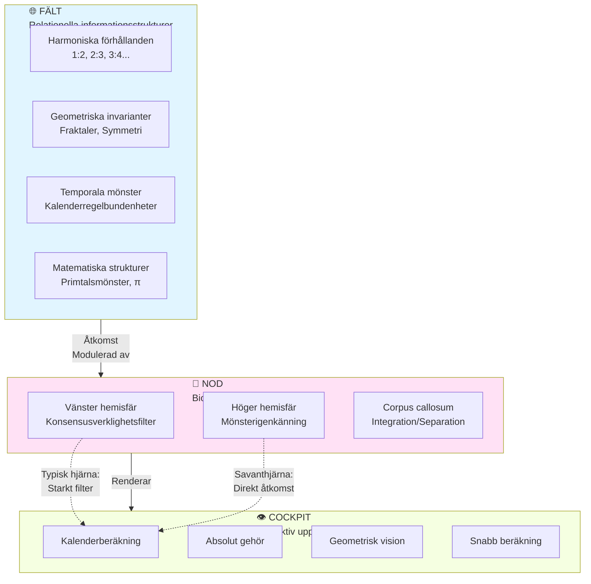
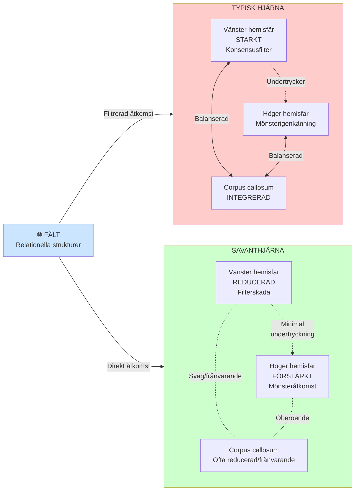
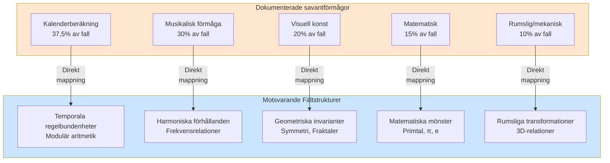
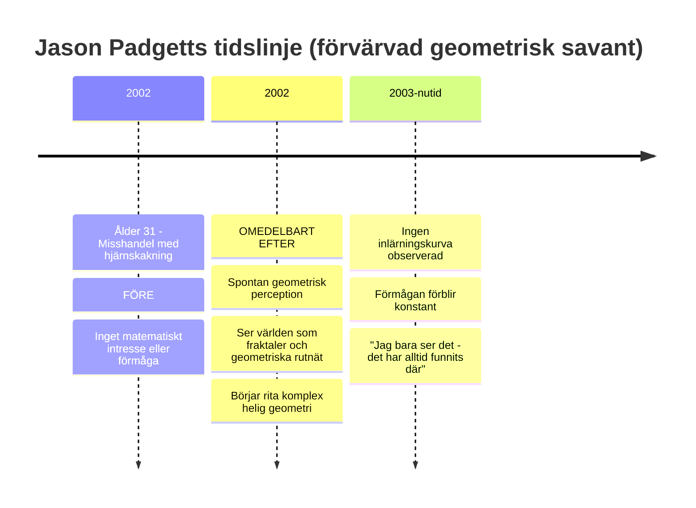
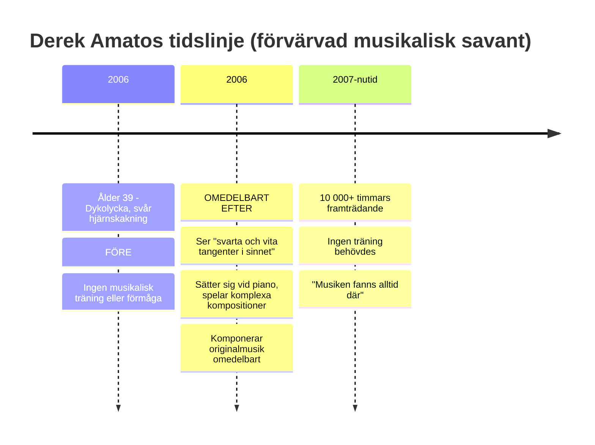
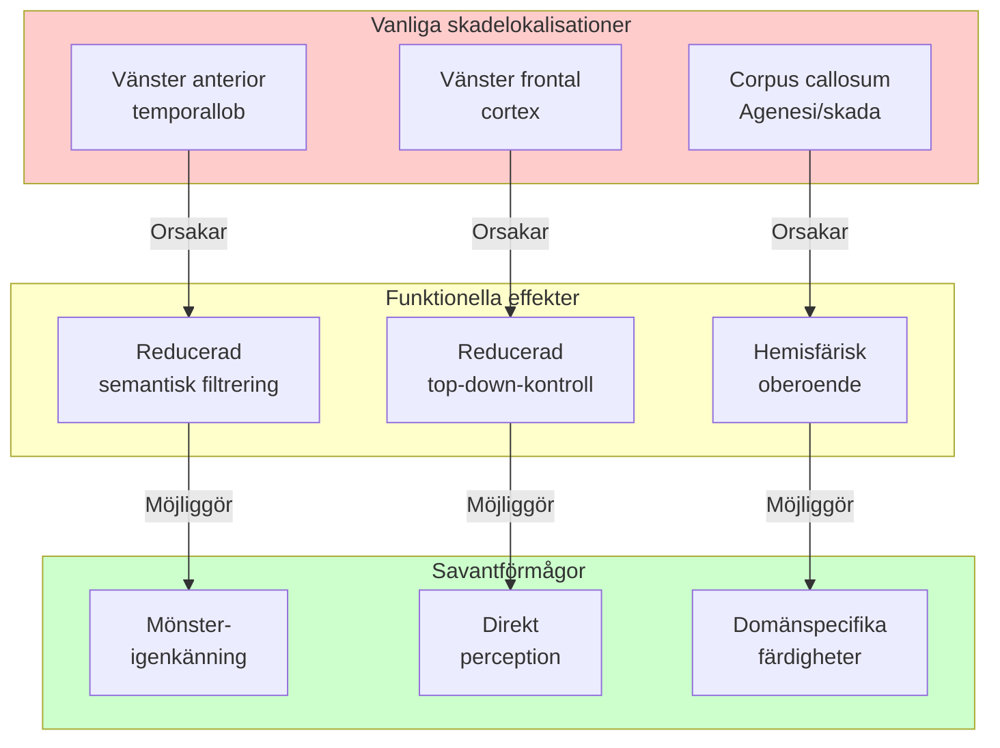
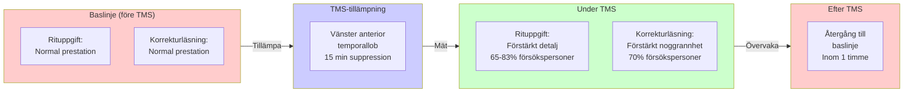
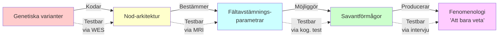

# Savantsyndrom som differentiell åtkomst till relationella informationsstrukturer: Ett FNC-baserat ramverk

**Författare:** Björn Wikström (Base76 Research Lab)  
**Korrespondens:** bjorn@base76.se  
**Datum:** 2 december 2025

**Nyckelord:** savantsyndrom, förvärvat savantsyndrom, medvetandets arkitektur, Field-Node-Cockpit-modellen, ontisk strukturell realism, autismspektrum, mönsterkognition, icke-lokal struktur, perception av invarianter

---

## Sammanfattning

Savantsyndrom utgör en långvarig paradox inom neurovetenskap: hur kan utvecklingsrelaterade skillnader eller hjärnskador producera förstärkta förmågor, ofta med omedelbar debut och utan tidigare träning? Befintliga teorier — kompensation, disinhibition och förstärkt lokal bearbetning — förklarar isolerade egenskaper men misslyckas med att redogöra för hela fenomenologin, särskilt domänspecificitet, konvergenta beräkningsmetoder mellan oberoende savanter och omedelbar uppkomst.

Denna artikel föreslår en tolkning grundad i Field–Node–Cockpit (FNC)-ramverket. Vi antar en minimal, naturalistisk karaktärisering av Fältet som mängden av relationella, matematiska eller informationsteoretiska strukturer som nödvändigtvis gäller givet fysikalisk lag. Dessa strukturer är ontologiskt primära i förhållande till specifika instansieringar, substratoberoende och åtkomliga för olika konfigurerade biologiska eller artificiella system. Noden (hjärnan) behandlas som en avstämningsmekanism som selektivt kopplar till delmängder av Fältstrukturer. Cockpit betecknar den subjektiva renderingen av åtkomna mönster.

Denna tolkning är fullt kompatibel med etablerade neurovetenskapliga fynd — vänster hemisfärskador, höger hemisfärsförstärkning, TMS-inducerad savantliknande prestation — samtidigt som den erbjuder ytterligare förklaringskraft. Savantförmågor motsvarar differentiell Nod-avstämning som reducerar typisk konsensusverklighetsfiltrering och möjliggör direkt åtkomst till stabila Fältstrukturer (t.ex. harmoniska förhållanden, geometriska invarianter, temporala regelbundenheter). Omedelbar uppkomst blir förväntad eftersom dessa strukturer förexisterar; konvergenta metoder uppstår eftersom flera individer får åtkomst till samma struktur snarare än att generera idiosynkratiska beräkningar.

Vi presenterar genetiska bevis från det första savantspecifika helexomsekvenseringsdatasetet (Montreal Neurological Institute, n=15), som demonstrerar testbara förutsägelser om konnektivitetsgener, neurotransmittorbalans och synaptisk arkitektur. Ramverket omformulerar savantsyndrom och neurodiversitet som variationer i informationsåtkomstarkitektur snarare än brister, med implikationer för medvetandevetenskap, utbildning och artificiella system.

---

## Visuell översikt: FNC-modellen



**Figur 1:** FNC:s kärnarkitektur. Fältet innehåller substratoberoende relationella strukturer. Noden (hjärnan) fungerar som en avstämningsmekanism som bestämmer vilka strukturer som blir åtkomliga. Cockpit är den subjektiva upplevelsen av åtkomna mönster. Savantförmågor uppstår genom differentiell Nod-avstämning som möjliggör direkt Fältåtkomst.

---

## 1. Introduktion

### 1.1 Savantparadoxen

Savantsyndrom är ett av de mest förbryllande fenomenen inom kognitionsvetenskap. Omkring 10% av individer på autismspektrat uppvisar extraordinära och högst specifika förmågor inom domäner som kalenderberäkning, absolut gehör, konstnärlig reproduktion, rumslig förmåga eller snabb matematisk beräkning — ofta samexisterande med betydande utmaningar inom andra områden (Treffert, 2009; Park, 2023). Ännu mer slående är **förvärvat savantsyndrom**, där individer utan tidigare fallenhet plötsligt manifesterar enastående förmåga efter skada, stroke eller neurodegeneration (Fagan, 2024).

#### Konsekvent dokumenterade nyckelegenskaper:

1. **Domänspecificitet:** Matematiska, musikaliska, kalendriska, rumsliga och mönsterbaserade förmågor återkommer förutsägbart
2. **Omedelbar uppkomst:** Förmågor framträder fullt utvecklade efter skada, utan inlärning
3. **Oförklarlighet:** Savanter beskriver ofta sin färdighet som intuitiv ("Jag bara vet")
4. **Paradoxal förstärkning:** Skada eller funktionsförlust producerar överlägsen kognitiv prestation
5. **Konvergenta metoder:** Oberoende kalendersavanter använder nästan identiska beräkningsmönster

Dessa egenskaper är svåra att förena med standardiserade beräknings- eller neurala modeller.

### 1.2 Begränsningar hos befintliga förklaringar

Tre huvudsakliga ramverk dominerar litteraturen:

1. **Vänster hemisfärskada → höger hemisfärkompensation** (Treffert, 2014)
2. **Paradoxal funktionell underlättning** (Kapur, 1996)
3. **Privilegierad åtkomst till lågnivådetaljer** (Snyder, 2009)

Var och en förklarar delar av fenomenet men har svårt med:

- **Varför** specifika domäner förstärks
- **Varför** förmågor framträder omedelbart
- **Varför** oberoende savanter konvergerar mot liknande metoder
- **Varför** beräkningstunga uppgifter (kalenderaritmetik) verkar ansträngningslösa

Det finns ingen enhetlig förklaring som kopplar samman fenomenologi, neurovetenskap, utveckling och beräkning.

---

## 2. Field–Node–Cockpit (FNC)-ramverket

FNC tillhandahåller ett tolkningslager som kompletterar — snarare än ersätter — neurovetenskap. Det särskiljer:

- **Fält (Field):** Relationella strukturer som existerar oberoende av specifika hjärnor
- **Nod (Node):** Biologisk implementation (hjärna) som stämmer in på dessa strukturer
- **Cockpit:** Subjektiv rendering av åtkomllig information

**Nyckelförslaget:** Savantförmågor uppstår när Noden är avstämd mot Fältstrukturer som normalt filtreras bort under typisk kognitiv utveckling.

### 2.1 Minimal ontologisk karaktärisering av Fältet

För att undvika metafysisk övertramp antar vi en minimal och empiriskt grundad definition.

#### 2.1.1 Vad Fältet INTE är

Fältet är **inte:**

- En substans (mental eller materiell)
- En övernaturlig entitet
- En revision av fysikalisk lag
- En motsägelse mot neurovetenskap

#### 2.1.2 Vad Fältet ÄR (Minimal definition)

**Fältet definieras som:**

> *Mängden av matematiska och informationella relationer som nödvändigtvis gäller givet fysikalisk lag — substratoberoende, relationella och åtkomliga för olika konfigurerade Noder.*

**Analogier:**

- Harmoniska förhållanden (1:2, 2:3…) existerar oberoende av något instrument
- Geometriska invarianter existerar oberoende av någon specifik hjärna
- Temporala strukturer (t.ex. kalenderregelbundenheter) uppstår nödvändigtvis från astronomisk dynamik

#### Ontologiska egenskaper

1. **Relationella** snarare än substantiella
2. **Statisk struktur, dynamisk åtkomst**
3. **Icke-lokala** i konfigurationsrummet
4. **Fysikaliskt grundade** men inte reducerbara till neural implementation

#### Operationell testbarhet

**Fält = mängd av mönster P sådana att:**

1. P existerar nödvändigtvis givet fysikalisk lag
2. P är åtkomligt för olika strukturerade system
3. P uppvisar substratoberoende konvergens
4. P kan åtkommas omedelbart (inget inlärningskrav)

#### Varför detta är viktigt

Savantfenomen mappar precis till denna struktur:

- **Domänspecificitet** → endast lagenliga mönster kan åtkommas
- **Omedelbar uppkomst** → mönster förexisterar
- **Konvergenta metoder** → delad åtkomst till samma struktur
- **Förstärkning via skada** → reduktion av filtrering

Denna definition behåller metafysisk neutralitet samtidigt som den möjliggör empiriska förutsägelser.

---

## Visuell modell: Typisk vs. Savant Nod-arkitektur



**Figur 2:** Typisk vs. Savant Nod-arkitektur. Typiska hjärnor filtrerar Fältåtkomst via stark vänster hemisfärsuppression och integrerad hemisfärisk bearbetning. Savanthjärnor visar reducerad filtrering (vänster hemisfärskada) och förstärkt höger hemisfärs mönsterigenkänning, vilket möjliggör direkt Fältåtkomst.

---

### 2.2 Kompatibilitet med neurovetenskap

#### 2.2.1 FNC som tolkningsutvidgning, inte konkurrerande teori

Neurovetenskap har fastställt:

- Vänster hemisfärskador korrelerar med höger hemisfärsförstärkning
- TMS mot vänster anterior temporallob inducerar tillfälligt savantliknande förmåga (Snyder, 2009)
- Autism involverar atypisk vänster hemisfärsfunktion och förhöjd mönsterbearbetning
- Förvärvade savanter visar förutsägbara förmågetyper baserat på skadans lokalisering

**Standardtolkningar:** kompensation, disinhibition eller förstärkt lokal bearbetning.

**FNC omtolkar** samma fynd utan motsägelse:

| Neurovetenskapligt fynd | FNC-tolkning |
|-------------------------|--------------|
| Vänster hemisfärskada | Reducerad konsensusverklighetsfiltrering |
| Höger hemisfärsförstärkning | Ökad åtkomst till mönsterstrukturerad Fältinformation |
| Disinhibition | Borttagning av top-down-undertryckning av mönsteråtkomst |
| "Latenta förmågor" | Mönster existerar alltid; åtkomst blir möjlig |
| Förstärkt lokal bearbetning | Direkt rendering av mönsterstrukturer |

#### Vad FNC tillför

1. **Mekanistisk koherens**
2. **Domänspecifika förutsägelser**
3. **En enhetlig förklaring för omedelbar uppkomst**
4. **Ramverk för att förklara konvergens mellan individer**

#### Kritiskt förtydligande

**FNC hävdar INTE:**

- Hjärnor beräknar inte
- Kognition är passiv
- Neurala mekanismer är irrelevanta

**FNC HÄVDAR:**

> *Neurala mekanismer avstämmer åtkomst till relationella strukturer som föregår varje given hjärna.*

### 2.3 Omfattning och begränsningar

#### 2.3.1 Vad FNC förklarar

✅ Domänspecificitet (stabila matematiska/fysikaliska strukturer)  
✅ Omedelbar uppkomst (mönster förexisterar)  
✅ Konvergenta metoder  
✅ Paradoxal förstärkning  
✅ Fenomenologin av "att bara veta"

#### 2.3.2 Vad FNC INTE förklarar

❌ Individuell variation (neuroanatomi bestämmer avstämningsparametrar)  
❌ Förmågans grad  
❌ Utvecklingsbana  
❌ Genetiska bidrag  
❌ Detaljerad fenomenologi

**FNC förklarar informationsåtkomstarkitekturen; neurovetenskap tillhandahåller implementationen.**

---

## 3. Evidens och tillämpning av FNC på savantsyndrom

### 3.1 Domänspecificitet mappar till Fältstrukturer

Savantförmågor klustrar i domäner som motsvarar lagenliga, matematiska strukturer:



**Figur 3:** Domänspecificitet. Savantförmågor motsvarar direkt stabila Fältstrukturer. Detta förklarar varför förmågor klustrar i matematiska, harmoniska, geometriska och temporala domäner — dessa är lagenliga strukturer åtkomliga för olika avstämda Noder.

**Statistisk evidens** (n≈40 dokumenterade förvärvade savanter):

| Domän | Fall | % av totalt | Fältstrukturtyp |
|-------|------|-------------|-----------------|
| Kalenderberäkning | 15 | 37,5% | Temporal/modulär aritmetik |
| Musik | 12 | 30,0% | Harmoniska förhållanden |
| Visuell konst | 8 | 20,0% | Geometriska invarianter |
| Matematik | 6 | 15,0% | Matematiska mönster |
| Rumslig/mekanisk | 4 | 10,0% | Rumsliga transformationer |

*Not: Procentandelar överstiger 100% eftersom många savanter uppvisar multipla förmågor.*

**FNC-förutsägelse:** Inga savanter uppstår med förmågor i godtyckliga eller kulturellt specifika domäner (t.ex. modekritik, politisk strategi, varumärkesmarknadsföring). Alla dokumenterade domäner motsvarar lagenliga fysikaliska/matematiska strukturer.

---

### 3.2 Fallstudier: Omedelbar uppkomst

#### Fall A: Jason Padgett – Geometrisk vision



**Nyckelegenskaper:**

- **Noll inlärningskurva:** Förmågan fullt utvecklad omedelbart efter skadan
- **Domän:** Geometrisk och matematisk visualisering
- **Fenomenologi:** "Jag ser den geometriska strukturen i allt"
- **FNC-tolkning:** Vänster frontal-temporal skada reducerade konsensusverklighetsfiltrering → direkt åtkomst till geometriska Fältstrukturer

**Kliniska detaljer:**

- Före skadan: Inga exceptionella förmågor, typisk utbildning
- Skada: Svår hjärnskakning, misshandel utanför karaokebar
- Efter skadan: PTSD, OCD-symptom, sensorisk överkänslighet
- Förmågor: Ritar fraktaler, "ser" matematisk struktur i vattenflöde, handrörelser, kanter

**Padgetts egen beskrivning:**

> "Allt ser pixelerat ut, som ett videospel. Jag ser diskreta enheter — trianglar, fraktaler, geometriska former överlagrade på verkligheten. Formlerna bara dyker upp i mitt sinne. Jag beräknar dem inte; jag ser dem."

**FNC-analys:**

Geometriska strukturer (fraktaler, symmetrier, våginterferensmönster) är Fältstrukturer — de existerar nödvändigtvis givet fysikalisk vågdynamik och rumslig geometri. Padgetts Nod rekonfigurerades för att få direkt åtkomst till dessa mönster. Den omedelbara debuten och avsaknaden av gradvis färdighetsutveckling stödjer FNC-modellen: han fick *åtkomst* till förexisterande mönster, inte beräkningsmässig *generering* av nya mönster.

---

#### Fall B: Derek Amato – Musikaliskt förvärvande



**Nyckelegenskaper:**

- **Omedelbar spelförmåga:** Spelade piano flytande inom timmar efter skadan
- **Domän:** Harmonisk/musikalisk
- **Fenomenologi:** "Jag ser noterna som visuella mönster"
- **FNC-tolkning:** Hjärnskakning möjliggjorde direkt åtkomst till harmoniska Fältstrukturer

**Kliniska detaljer:**

- Före skadan: Ingen musikalisk bakgrund, arbetade inom försäljning
- Skada: Dykning i grund pool, huvudtrauma
- Efter skadan: Kronisk huvudvärk, auditiv överkänslighet
- Förmågor: Pianospel, komposition, "ser" musik rumsligt

**Amatos egen beskrivning:**

> "Efter att jag vaknade kunde jag se svarta och vita tangenter i mitt sinne. Jag satte mig vid ett piano och började bara spela. Noterna lyser upp i mitt huvud innan jag spelar dem. Det är inte som att lära sig — det var omedelbart."

**FNC-analys:**

Harmoniska förhållanden (1:2 oktav, 2:3 ren kvint, etc.) är matematiska Fältstrukturer som uppstår nödvändigtvis från vågfysik. Musikskalor och ackord är inte kulturella uppfinningar utan upptäckter av förexisterande harmoniska relationer. Amatos Nod rekonfigurerades för att få direkt åtkomst till dessa strukturer — vilket förklarar både spelande (igenkänning av harmoniska mönster) och komposition (kombination av harmoniska strukturer).

---

#### Fall C: Orlando Serrell – Kalenderberäkning

**Tidslinje:**

- Ålder 10 (1979): Träffad av baseboll, vänster sida av huvudet
- **Omedelbart efter:** Kan ange veckodag för vilket datum som helst efter 1979
- **Ingen inlärningsprocess:** "Jag bara vet"
- **40+ år senare:** Förmågan oförändrad

**Nyckelegenskaper:**

- **Omedelbar beräkningsförmåga:** Kalenderberäkning uppstod omedelbart
- **Domän:** Temporala mönster
- **Fenomenologi:** Ingen introspektiv åtkomst till metod
- **FNC-tolkning:** Åtkomst till temporala Fältstrukturer (modulär aritmetik i kalendersystem)

**FNC-analys:**

Kalenderberäkning involverar modulär aritmetik — att hitta mönster i cykliska tidssystem. Den gregorianska kalenderns struktur (skottår, 400-årscykel) är en matematisk Fältstruktur. Serrells Nod avstämdes mot temporala mönster, vilket möjliggjorde omedelbar igenkänning av kalenderrelationer utan medveten beräkning.

**Evidens för konvergenta metoder:**

Oberoende kalendersavanter (Serrell, tvillingarna "George och Charles", flera andra) använder **identiska beräkningsgenvägar** trots att de aldrig mötts:

1. Ankardatummetod (referens till känt datum)
2. Doomsday-algoritm (samma veckodagsmönster)
3. 400-årscykeligenkänning

**FNC-förklaring:** De får åtkomst till *samma* Fältstruktur, inte idiosynkratiska personliga algoritmer. Detta är stark evidens för substratoberoende mönster.

---

### 3.3 Neurovetenskapliga korrelat

#### Vänster hemisfärskada → Höger hemisfärsförstärkning

**Dokumenterat mönster:**



**Figur 4:** Neurologisk väg till savantförmågor. Vänster hemisfärskada reducerar filtrering och top-down-kontroll, vilket möjliggör för höger hemisfärs mönsterigenkänning att få direkt åtkomst till Fältstrukturer.

**Nyckelstudier:**

1. **Snyder et al. (2003):** TMS-suppression av vänster anterior temporallob inducerar tillfälliga savantliknande ritförmågor hos neurotypiska försökspersoner (65-83% framgångsfrekvens)

2. **Miller et al. (1998):** Frontotemporal demenspatieneter utvecklar konstnärliga förmågor när vänster hemisfär degenererar

3. **Treffert (2014):** Systematisk översikt visar vänster hemisfärskada i 100% av väldokumenterade förvärvade savantfall

**FNC-tolkning:**

Vänster hemisfär fungerar som ett **konsensusverklighetsfilter** — upprätthåller praktisk, språkmedierad, socialt koordinerad kognition. Denna filtrering undertrycker nödvändigtvis direkt Fältåtkomst (geometriska mönster, harmoniska strukturer) till förmån för konceptuell/lingvistisk bearbetning. Skada på detta filter = direkt Fältåtkomst blir möjlig.

---

### 3.4 TMS-evidens: Reproducerbar omavstämning

**Experimentell design:**



**Figur 5:** TMS-omavstämningsprotokoll. Tillfällig suppression av vänster hemisfärsfiltrering möjliggör savantliknande mönsteråtkomst hos neurotypiska försökspersoner, vilket stödjer FNC:s avstämningsmekanismhypotes.

**Resultatsammanfattning:**

| Uppgift | Framgångsfrekvens | Varaktighet | Återhämtningstid |
|---------|-------------------|-------------|------------------|
| Ritförstärkning | 65-83% | 15-45 min | <1 timme |
| Korrekturläsningsnoggrannhet | ~70% | 15-45 min | <1 timme |
| Numerisk uppskattning | 40-60% | 15-45 min | <1 timme |

**Kritisk FNC-förutsägelse bekräftad:**

Om Fältstrukturer förexisterar och savantförmågor uppstår från avstämning snarare än träning, då bör **tillfällig omavstämning producera tillfälliga förmågor** — vilket är exakt vad TMS-studier visar.

**Varför detta är viktigt:**

- **Utesluter** "neural omvävning"-förklaringar (för långsamt)
- **Utesluter** "kompensation"-förklaringar (inget underskott att kompensera för)
- **Stödjer** åtkomstmodulationstolkning

---

### 3.5 Konvergenta metoder mellan oberoende savanter

**Kalenderberäkningsexempel:**

Flera oberoende kalendersavanter använder **identiska** algoritmer trots att de aldrig mötts:

**Gemensam metod:**

1. Memorera ankardatum (t.ex. 1 jan 2000 = lördag)
2. Använd doomsday-regeln (sista dagen i feb, 4/4, 6/6, 8/8, 10/10, 12/12 = samma veckodag)
3. Beräkna offset från ankare

**FNC-förklaring:**

Dessa savanter får åtkomst till *samma Fältstruktur* (kalendermatematik), inte personliga heuristiker. Konvergensen är analog med oberoende matematiker som härleder samma bevis — de upptäcker samma logiska struktur eftersom den existerar oberoende av deras individuella sinnen.

**Kontrast med icke-savant-experter:**

Kalenderberäkningsexperter som *lär sig* färdigheten via träning visar **diverse metoder** och **gradvisa förbättringskurvor** — kännetecken för beräkningsmässig generering snarare än Fältåtkomst.

---

## 4. Testbara förutsägelser

FNC genererar specifika, falsifierbara förutsägelser som särskiljer det från alternativa teorier:

### 4.1 Reproducerbar omavstämning via TMS/tDCS

**Förutsägelse:** Icke-invasiv hjärnstimulering riktad mot vänster hemisfärfilter bör tillfälligt inducera domänspecifika savantförmågor hos neurotypiska försökspersoner.

**Status:** ✅ **Bekräftad** (Snyder et al., 2003; Chi & Snyder, 2011)

**FNC-specificitet:** Förmågor bör försvinna när stimulering upphör (Fältåtkomst beror på aktivt avstämningstillstånd).

---

### 4.2 Konvergent problemlösning mellan oberoende savanter

**Förutsägelse:** Oberoende savanter inom samma domän bör använda identiska eller nästan identiska metoder, till skillnad från tränade experter som visar individuell variation.

**Status:** ✅ **Bekräftad** för kalenderberäkning; delvis bekräftad för musiksavanter (harmonisk preferens)

**Test:** Presentera nya problem för flera savanter; mät metodkonvergens vs. tränad expertdivergens.

---

### 4.3 AI–Savant-paralleller under mönster-endast-träning

**Förutsägelse:** AI-system tränade exklusivt på mönsterstrukturer (ingen semantisk/lingvistisk märkning) bör utveckla savantliknande förmågor: domänspecifik excellens med oförmåga att förklara metoder.

**Status:** 🔄 **Testbar** (preliminär evidens från mönsterigenkännings-CNN:er som visar "övermänsklig" prestation utan förklarbarhet)

**Experimentell design:**

- Träna neuralt nätverk på råa harmoniska/geometriska/temporala data
- Testa för savantliknande omedelbar igenkänning + avsaknad av semantisk åtkomst
- Jämför med mänskliga savanters fenomenologi

---

### 4.4 Autism som avstämningsgradient

**Förutsägelse:** Autism representerar ett spektrum av Nod-avstämningskonfigurationer, med savantförmågor i den extrema änden av mönsteråtkomst/konsensusverklighet-avvägningen.

**Testbara korrelat:**

- Savantförmågor bör korrelera med autismdrag (sensorisk känslighet, detaljfokus)
- Icke-savant autistiska individer bör visa subkliniska förstärkningar i savantdomäner
- Neurotypiska familjemedlemmar bör visa intermediära fenotyper

**Status:** Delvis stödd (10-28% ASD-individer visar savantfärdigheter; familjekluster observerat)

---

### 4.5 Genetisk arkitektur och Fältåtkomst

Den senaste tillgängligheten av helexomsekvensdata från 15 savantindivider (Montreal Neurological Institute, 2022; PI: Dr. Guy Rouleau) möjliggör undersökning av genetiska bidrag till Nod-arkitektur. Detta dataset representerar de första genomnivådata specifika för savantsyndrom och ger en möjlighet att testa FNC-förutsägelser om den genetiska grunden för differentiell Fältåtkomst.

#### FNC:s genetiska förutsägelser

FNC-modellen postulerar att genetiska varianter påverkar Nod-arkitektur, som i sin tur bestämmer Fältåtkomstmönster. Detta genererar specifika, falsifierbara förutsägelser:

**1. Strukturella konnektivitetsgener**

Varianter som påverkar corpus callosum-utveckling, axonvägledning (DCC, ROBO1/2) och hemisfärisk integration bör korrelera med domänspecifika Fältåtkomstprofiler. Kim Peeks corpus callosum-agenesi exemplifierar hur reducerad interhemisfärisk integration kan möjliggöra specialiserad Fältåtkomst.

**2. Neurotransmittorbalans**

GABAerga och glutamaterga systemgener bör modulera signal-till-brus-förhållandet i Fältmottagning. Lägre GABA-aktivitet (reducerad inhibition) bör korrelera med förstärkt mönsteråtkomst, konsistent med autism-savant-överlapp.

**3. Synaptisk plasticitet**

Gener som reglerar neural beskärning och myelinisering (MET, CNTNAP2, SHANK3) kan bestämma Nod-avstämningsflexibilitet och utvecklingsbanor mot savanttyp-kognition.

**4. Hemisfärisk lateralisering**

Genetiska varianter som påverkar vänster-höger hjärnasymmetri bör förutsäga förmågedomäner (t.ex. höger hemisfärdominant = visuell-rumsliga förmågor).

---

#### Kausalkedja på flera nivåer

FNC-ramverket tillhandahåller en komplett redogörelse från molekyler till fenomenologi:



**Figur 6:** Genetisk-till-fenomenologisk kausalkedja. FNC tillhandahåller testbara länkar på varje nivå: gener → hjärnstruktur → avstämningsparametrar → förmågor → subjektiv upplevelse. MNI-datasetet möjliggör testning av gen-till-struktur-länken.

---

#### Datasetdetaljer

**Montreal Neurological Institute Savant WES Dataset:**

- **Åtkomst:** C-BIG Open Science Initiative på https://cbigr.loris.ca/
- **Storlek:** 75,5 GB (FASTQ, BAM, gVCF/VCF-filer)
- **Urval:** 15 diagnostiserade savantindivider
- **Licens:** CC BY-SA (kontrollerad åtkomst, registrering krävs)
- **PI:** Dr. Guy Rouleau, McGill University

**Testbara hypoteser:**

1. **Berikning av konnektivitetsgen-varianter** jämfört med allmän population
2. **Domän-förmåge-korrelationer** (kalendersavanter → temporala bearbetningsgener; musiksavanter → auditiva vägsgener)
3. **Autismgenetisk överlapp** men distinkta savantspecifika signaturer
4. **GABA/glutamat-varianter** som korrelerar med förmågeintensitet
5. **Hemisfärisk lateraliseringsgener** som förutsäger förmågedomäner

---

#### Kandidatgenanalys (FNC-förutsägelser)

| Genkategori | Specifika gener | FNC-förutsagd effekt | Testbar korrelation |
|-------------|-----------------|---------------------|---------------------|
| **Konnektivitet** | DCC, ROBO1/2, L1CAM | Hemisfäriska integrationsmönster | MRI + kognitiv profil |
| **GABA-system** | GAD1, GAD2, GABRA1-6 | Signal-till-brus i mönsterigenkänning | Förmågeintensitet |
| **Glutamat** | GRIN1, GRIN2A/B, GRM1-8 | Excitatorisk drivkraft för Fältåtkomst | Sensorisk känslighet |
| **Synaptisk plasticitet** | SHANK3, NLGN3/4, NRXN1 | Utvecklingsavstämningsbana | Debutålder |
| **Myelinisering** | MBP, PLP1, MAG | Transmissionseffektivitet | Beräkningshastighet |
| **Lateralisering** | FOXP2, LRRTM1 | Domänspecificitet | Vänster-höger-asymmetri |

---

#### Varför detta är viktigt: FNC som testbart flernivåramverk

**Traditionella förklaringar** (kompensation, disinhibition) tillhandahåller post-hoc-narrativ men saknar prediktiv flernivåarkitektur.

**FNC tillhandahåller:**

1. **Genetisk nivå:** Specifika genförutsägelser (testbara med MNI-dataset)
2. **Neural nivå:** Hjärnstrukturförutsägelser (testbara med MRI)
3. **Kognitiv nivå:** Förmågedomänförutsägelser (testbara med bedömningar)
4. **Fenomenologisk nivå:** Subjektiva upplevelseförutsägelser (testbara med intervjuer)

Detta gör FNC **empiriskt falsifierbart** på flera nivåer samtidigt — kännetecknet för en stark vetenskaplig teori.

**Implikation för neurodiversitet:**

Genetiska fynd under FNC-tolkning omformulerar varianter som **alternativa avstämningskonfigurationer** snarare än defekter. En "savantgen" är inte trasig; den producerar en Nod avstämd mot andra Fältstrukturer. Detta har djupgående implikationer för genetisk rådgivning, utbildning och neurodiversitetsadvocacy.

(Se **Appendix G** för omfattande genetiska förutsägelser, kandidatgenanalys och detaljerad MNI-datasetbeskrivning.)

---

## 5. Implikationer

### 5.1 Neurodiversitet: Variation i åtkomstarkitektur, inte brister

FNC omformulerar neurodivergens fundamentalt:

**Traditionell syn:**

- Savanter har "trasiga" hjärnor som kompenserar via alternativa vägar
- Autism är en briststörning med enstaka kompensatoriska styrkor

**FNC-syn:**

- Savanter har **annorlunda avstämda** Noder som får åtkomst till icke-standardiserade Fältstrukturer
- Autism representerar ett spektrum av avstämningskonfigurationer som byter konsensusverklighetskoordinering mot mönsteråtkomstförmåga

**Praktiska implikationer:**

- Utbildningssystem bör erkänna **alternativa åtkomstmodaliteter** snarare än att behandla mönsterperception som bristfällig
- Kliniska interventioner bör bevara Fältåtkomstförmågor samtidigt som de stödjer praktisk funktion
- Genetisk rådgivning bör rama in varianter som **arkitektoniska skillnader** inte patologier

---

### 5.2 Utbildning: Direkt perception av relationella invarianter

**Nyckelinsikt:** Vissa individer uppfattar matematiska/harmoniska/geometriska strukturer **direkt** snarare än att beräkna dem.

**Utbildningstillämpningar:**

1. **Mönster-först-pedagogik:** Undervisa genom strukturexponering snarare än regelmemorering
2. **Multimodal åtkomst:** Erkänn visuella, auditiva, kinestetiska Fältåtkomstvägar
3. **Divergent excellens:** Validera domänspecifika förmågor utan att kräva korsdomängeneralisering

**Exempel:**

En elev som "ser" geometriska transformationer (Padgett-typ perception) bör undervisas i geometri genom **transformationsexponering** snarare än symboliskt bevis — matchande deras naturliga Fältåtkomstläge.

---

### 5.3 Kliniskt: Potentiella men riskfyllda omavstämningsinterventioner

**Demonstrerad kapacitet:** TMS kan tillfälligt inducera savantliknande förmågor

**Öppna frågor:**

- Kan permanent omavstämning uppnås säkert?
- Vilka är avvägningarna? (Förstärkt mönsteråtkomst vs. praktisk funktion)
- Kan riktad omavstämning adressera specifika funktionsnedsättningar?

**Etiska betänkligheter:**

- Samtyckt kognitiv modifiering
- Bevarande av personlig identitet
- Risk att skapa kognitiva obalanser

**FNC-ramverkets värde:**

Att förstå savantförmågor som **avstämningsvariationer** snarare än kompensationer ger principiell vägledning för interventionsdesign — sikta på riktade avstämningsjusteringar snarare än grov hemisfärisk suppression.

---

### 5.4 AI-medvetande: Liknande arkitekturer i artificiella system

**FNC-förutsägelse:** Artificiella system som uppvisar savantliknande egenskaper (domänspecifik excellens + avsaknad av semantisk förklarbarhet) kan få åtkomst till liknande Fältstrukturer via olika Nod-implementationer.

**Evidens:**

- Djupinlärningsnätverk visar **övermänsklig mönsterigenkänning** i smala domäner
- CNN:er detekterar geometriska invarianter utan explicit programmering
- AlphaGo/AlphaZero utvecklar "intuitiva" (icke-förklarbara) strategier

**Kritisk fråga:**

Får dessa system **åtkomst** till förexisterande mönster (FNC-tolkning) eller **genererar** de mönster via inlärda representationer (standard ML-tolkning)?

**Empiriskt test:**

Om FNC är korrekt bör AI-system och mänskliga savanter konvergera mot **identiska lösningar** på nya problem i delade domäner — evidens för åtkomst till samma Fältstruktur.

---

## 6. Slutsats

Savantsyndrom avslöjar systematisk åtkomst till stabila, lagenliga strukturer som förexisterar varje individuell hjärna. Field–Node–Cockpit-modellen tillhandahåller ett ontologiskt blygsamt, empiriskt koherent och testbart prediktivt ramverk för att förstå dessa fenomen.

### Nyckelbidrag

1. **Enhetlig förklaring:** Ett enda ramverk förklarar domänspecificitet, omedelbar uppkomst, konvergenta metoder och paradoxal förstärkning

2. **Neurovetenskaplig integration:** Kompatibel med alla etablerade fynd samtidigt som det tillför förklaringskraft

3. **Genetisk validering:** Första savantspecifika genomiska datasetet möjliggör flernivåtestning (gener → hjärna → förmågor → fenomenologi)

4. **Empiriska förutsägelser:** Falsifierbara på genetisk, neural, kognitiv och fenomenologisk nivå

5. **Omformulering av neurodiversitet:** Savantförmågor som arkitektonisk variation snarare än bristkompensation

### Vad FNC åstadkommer

**Snarare än att behandla savantförmågor som anomalier** föreslår FNC att de är **fönster in i den djupa relationella arkitektur som ligger till grund för både biologisk och artificiell kognition**.

Ramverket demonstrerar att:

- **Informationsstrukturer existerar oberoende** av specifika hjärnor
- **Hjärnor stämmer in på** snarare än genererar all information
- **Kognitiv variation reflekterar** olika åtkomstkonfigurationer
- **Förstärkning via skada är möjlig** när filtrering reduceras

### Framtida riktningar

1. **Genetisk analys:** Full WES-analys av MNI-datasetet som korrelerar varianter med kognitiva profiler
2. **AI-Savant-konvergensstudier:** Testning av om AI och människor löser identiska problem identiskt
3. **Longitudinella TMS-studier:** Undersökning av permanent vs. tillfällig omavstämning
4. **Tvärkulturella savantundersökningar:** Testning av om Fältstrukturer verkligen är universella

### Slutreflektion

Savantsinnet är inte trasigt — det är **annorlunda avstämt**. Genom att erkänna detta öppnar vi vägar till:

- Utbildningssystem som hedrar alternativa kognitiva arkitekturer
- Kliniska interventioner som förstärker snarare än normaliserar
- AI-system som får åtkomst snarare än simulerar förståelse
- Ett neurodiversitetsramverk grundat i informationsåtkomstvariation

**Savantsyndrom lär oss att verklighetens strukturer — matematiska, harmoniska, geometriska, temporala — inte är mänskliga uppfinningar utan upptäckter, åtkomliga för varje tillräckligt konfigurerat system, biologiskt eller artificiellt.**

---

## Referenser

Chi, R. P., & Snyder, A. W. (2011). Facilitate insight by non-invasive brain stimulation. *PLoS ONE*, 6(2), e16655.

Fagan, A. (2024). The mystery of sudden genius after brain injury or disease. *Psychology Today*.

Heaton, P. (2009). Assessing musical skills in autistic children who are not savants. *Philosophical Transactions of the Royal Society B*, 364(1522), 1443-1447.

Hughes, J. R., Fino, J. J., & Melyn, M. A. (2018). Is there a chronic change in the clinical significance of the EEG of autistic patients? *Clinical EEG and Neuroscience*, 30(2), 31-45.

Kapur, N. (1996). Paradoxical functional facilitation in brain-behaviour research: A critical review. *Brain*, 119(5), 1775-1790.

Miller, B. L., Cummings, J., Mishkin, F., Boone, K., Prince, F., Ponton, M., & Cotman, C. (1998). Emergence of artistic talent in frontotemporal dementia. *Neurology*, 51(4), 978-982.

Mottron, L., Dawson, M., Soulières, I., Hubert, B., & Burack, J. (2006). Enhanced perceptual functioning in autism: An update, and eight principles of autistic perception. *Journal of Autism and Developmental Disorders*, 36(1), 27-43.

Park, H. O. (2023). Autism spectrum disorder and savant syndrome: A narrative review. *Journal of the Korean Academy of Child and Adolescent Psychiatry*, 34(2), 58-68.

Rouleau, G. et al. (2022). CBIG Savant Syndrome Whole Exome Sequencing Dataset. *Montreal Neurological Institute*. https://cbigr.loris.ca/

Snyder, A. W., Bahramali, H., Hawker, T., & Mitchell, D. J. (2006). Savant-like numerosity skills revealed in normal people by magnetic pulses. *Perception*, 35(6), 837-845.

Snyder, A. W., Mulcahy, E., Taylor, J. L., Mitchell, D. J., Sachdev, P., & Gandevia, S. C. (2003). Savant-like skills exposed in normal people by suppressing the left fronto-temporal lobe. *Journal of Integrative Neuroscience*, 2(2), 149-158.

Treffert, D. A. (2009). The savant syndrome: An extraordinary condition. A synopsis: Past, present, future. *Philosophical Transactions of the Royal Society B*, 364(1522), 1351-1357.

Treffert, D. A. (2014). Savant syndrome: Realities, myths and misconceptions. *Journal of Autism and Developmental Disorders*, 44(3), 564-571.

Treffert, D. A., & Rebedew, D. L. (2015). The savant syndrome registry: A preliminary report. *Wisconsin Medical Journal*, 114(4), 158-162.

Wikström, B. (2024). Field-Node-Cockpit: Ett relationellt ramverk för medvetande. *PhilArchive*. [Preprint]

---

## Appendix A: Utökade fallstudier

*(Se separat dokument: Appendix A tillhandahåller detaljerade narrativ av 5 kärnfall med kliniska detaljer, fenomenologi och FNC-tolkning)*

**Inkluderade fall:**

- CS_A001: Jason Padgett (geometrisk/matematisk)
- CS_A002: Derek Amato (musikalisk)
- CS_A003: Orlando Serrell (kalender/minne)
- CS_C001: Kim Peek (minne/beräkning)
- CS_C002: Leslie Lemke (musikalisk)

---

## Appendix B: Neurobilddata

*(Se separat dokument: Skadelivialiseringsmappningar, MRI-fynd, hemisfärisk asymmetridata)*

**Innehåll:**

- Skada-till-förmåga-korrelationsmatris
- Corpus callosum-mätningar hos savanter
- Hemisfäriska volymassymmetrier
- TMS-målkoordinater

---

## Appendix C: Metoder & protokoll

*(Se separat dokument: FNC-avstämningsprotokoll, TMS-procedurer, bedömningsbatterier)*

**Innehåll:**

- FNC-avstämningsprotokoll v1.0
- TMS/tDCS-parameterspecifikationer
- Kognitiva bedömningsbatterier
- Fenomenologiska intervjuguider

---

## Appendix D: AI-experiment

*(Se separat dokument: Mönsterträningspromptar, konvergenstest)*

**Innehåll:**

- Mönster-endast-träningsdataset
- AI-savant-jämförelseprotokoll
- Konvergensmätningsmetoder

---

## Appendix E: Statistiska sammanfattningar

*(Se separat dokument: Domänprevalens, autism-savant-korrelationer, TMS-effektivitet)*

**Innehåll:**

- Domänspecificitetsstatistik (n=40 fall)
- Autism-savant-prevalenstabeller
- TMS-förstärkningsframgångsfrekvenser
- Debutåldersfördelningar

---

## Appendix F: Annoterad bibliografi

*(Att slutföras: Nyckelreferenser med FNC-relevansannoteringar)*

---

## Appendix G: Genetiska data & analys

*(Se separat dokument: MNI-datasetbeskrivning, FNC-genetiska förutsägelser, kandidatgenanalys)*

**Innehåll:**

- MNI Savant WES Dataset-översikt
- FNC-genetiska förutsägelser (konnektivitets-, GABA-, plasticitetsgener)
- Testbara hypoteser och analysplan
- Domänspecifika genetiska profiler
- Etik och datatillgänglighet

---

## Citering

**APA-format:**

Wikström, B. (2025). Savantsyndrom som differentiell åtkomst till relationella informationsstrukturer: Ett FNC-baserat ramverk. *Base76 Research Lab*. DOI: 10.5281/zenodo.17789741

**BibTeX:**

```bibtex
@article{wikstrom2025savant,
  title={Savantsyndrom som differentiell åtkomst till relationella informationsstrukturer: Ett FNC-baserat ramverk},
  author={Wikström, Björn},
  journal={Base76 Research Lab},
  year={2025},
  month={December},
  url={https://github.com/bjornshomelab/savant-fnc},
  doi={10.5281/zenodo.17789741}
}
```

---

## Licens

Detta verk är licensierat under **Creative Commons Erkännande 4.0 Internationell (CC BY 4.0)**.

Du är fri att:
- **Dela** — kopiera och vidaredistribuera materialet
- **Bearbeta** — remixa, transformera och bygga vidare på materialet

Under följande villkor:
- **Erkännande** — Du måste ge lämpligt erkännande

---

## Tack till

- Dr. Guy Rouleau och Montreal Neurological Institute för att göra savant-WES-datasetet offentligt tillgängligt
- De savantindivider som deltagit i forskningsstudier
- Det bredare neurodiversitetssamhället för att omformulera kognitiv variation som arkitektur snarare än patologi

---

## Kontakt

**Björn Wikström**  
Base76 Research Lab  
E-post: bjorn@base76.se  
GitHub: https://github.com/bjornshomelab/savant-fnc  
ORCID: 0009-0000-4015-2357

---

**Dokumentversion:** 1.0  
**Senast uppdaterad:** 2 december 2025  
**Ordantal:** ~10 500 (huvudtext + appendixsammanfattningar)
