# 📊 Savant-FNC: Key Results

> **Empirical findings supporting the FNC interpretation of savant syndrome**

[](../scripts/)
[](../scripts/run_analysis.py)
[]()

---

## 🎯 Results Overview

```mermaid
graph LR
    subgraph Evidence["Empirical Evidence"]
        S["📈 Statistical<br/>Analysis"]
        V["📊 Visual<br/>Evidence"]
        G["🧬 Genetic<br/>Predictions"]
    end
    
    subgraph Findings["Key Findings"]
        F1["Autism-Savant<br/>OR = 109,444x"]
        F2["TMS Enhancement<br/>d = 1.64"]
        F3["Left Hemisphere<br/>93% of cases"]
        F4["Domain Clustering<br/>χ² = 426.8"]
    end
    
    subgraph FNC["FNC Support"]
        N["Node Modification<br/>Hypothesis ✓"]
        FL["Field Access<br/>Channels ✓"]
        T["Tuning<br/>Modifiability ✓"]
    end
    
    S --> F1 & F2
    V --> F3 & F4
    G --> N
    
    F1 --> N
    F2 --> T
    F3 --> N
    F4 --> FL
    
    style F1 fill:#e8f5e9,stroke:#2e7d32
    style F2 fill:#e8f5e9,stroke:#2e7d32
    style F3 fill:#e8f5e9,stroke:#2e7d32
    style F4 fill:#e8f5e9,stroke:#2e7d32
```



---

## 📈 Statistical Evidence

### 1. Autism-Savant Association

| Metric | Value | Interpretation |
|--------|-------|----------------|
| **Odds Ratio** | 109,444 | Autism increases savant odds 100,000x |
| **95% CI** | 15,405 – 777,546 | Robust effect |
| **p-value** | < 0.001 | Highly significant |

> **🧠 FNC Interpretation:** The extreme association supports the hypothesis that autism and savant syndrome share underlying Node modification mechanisms — both involve altered filtering of Field information.

### 2. Domain Specificity

| Domain | Prevalence | Status |
|--------|------------|--------|
| 🎵 Music | 32% | ⬆️ Over-represented |
| 🎨 Art | 29% | ⬆️ Over-represented |
| 📅 Calendar | 18% | Expected |
| 🔢 Mathematics | 12% | Expected |
| 🔧 Mechanical | 6% | ⬇️ Under-represented |
| 🗣️ Language | 3% | ⬇️ Under-represented |

**Chi-square:** χ² = 426.8, df = 5, p < .001  
**Effect Size:** Cramér's V = 0.29 (medium)

> **🧠 FNC Interpretation:** The non-random clustering of abilities in Music and Art domains supports the hypothesis that the Field has structured information channels — some channels (harmonic ratios, geometric invariants) may be more accessible than others.

### 3. TMS/tDCS Enhancement Effects

| Study | Domain | Cohen's d | Magnitude |
|-------|--------|-----------|-----------|
| Snyder & Mitchell (1999) | Drawing | 2.43 | Large |
| Snyder et al. (2003) | Numerosity | 1.47 | Large |
| Young et al. (2004) | Proofreading | 0.99 | Large |
| Chi & Snyder (2011) | Insight | 1.45 | Large |
| Chi & Snyder (2012) | Matchstick | 1.84 | Large |
| **Meta-Analysis** | **Combined** | **1.64** | **Large** |

> **🧠 FNC Interpretation:** The large, consistent effect sizes demonstrate that Node tuning can be temporarily modified through brain stimulation, supporting FNC's claim that savant abilities emerge from tuning differences rather than unique brain structures.

### 4. Lesion Lateralization

| Hemisphere | Cases | Percentage |
|------------|-------|------------|
| **Left** | 28 | 93% |
| Right | 2 | 7% |

**Binomial test:** p < 0.0001

> **🧠 FNC Interpretation:** The dramatic left-hemisphere dominance supports the inhibition-release model — left hemisphere damage reduces analytical filtering, enabling direct Field access through the right hemisphere.

---

## 📊 Visual Evidence

### FNC Tuning Comparison: Typical vs Savant


**What this shows:**
- **Left (Typical):** Broad but shallow Field access — Node filters most channels
- **Right (Savant):** Narrow but deep Field access — one channel wide open

> 💡 **Key Insight:** Same Field, different tuning → Different Cockpit experience

---

### Savant Domain Distribution


**What this shows:**
- Music and Art dominate (61% combined)
- Pattern reflects Field channel accessibility
- Savant abilities cluster in domains with clear relational structures

---

### Lesion Locations in Acquired Savants


**What this shows:**
- Left temporal lobe most commonly involved (72%)
- Left hemisphere lesions dominate (93%)
- Different lesion locations → different emerging domains

---

### Acquired Savant Timelines


**What this shows:**
- Injury → Ability emergence pathway for 4 cases
- Onset varies: immediate to months
- Pattern: Node disruption → Field reconfiguration → New tuning stable

---

## 🧬 Genetic Predictions

### FNC Tuning Gene Categories

```mermaid
graph TD
    subgraph Genes["Node Tuning Genes"]
        F["🔊 Frequency<br/>CACNA1C, SCN2A"]
        I["🔗 Integration<br/>SHANK3, NRXN1"]
        B["📡 Bandwidth<br/>MBP, CNTNAP2"]
        FL["🚪 Filtering<br/>GABRA1, GRIN2B"]
    end
    
    subgraph Effects["FNC Effects"]
        E1["Oscillation<br/>patterns"]
        E2["Signal<br/>combination"]
        E3["Information<br/>throughput"]
        E4["E/I<br/>balance"]
    end
    
    subgraph Domains["Predicted Domains"]
        D1["Music<br/>Mathematics"]
        D2["Calendar<br/>Memory"]
        D3["Art<br/>Spatial"]
        D4["Broad access<br/>Multiple"]
    end
    
    F --> E1 --> D1
    I --> E2 --> D2
    B --> E3 --> D3
    FL --> E4 --> D4
    
    style F fill:#e3f2fd,stroke:#1976d2
    style I fill:#fff3e0,stroke:#f57c00
    style B fill:#f3e5f5,stroke:#7b1fa2
    style FL fill:#e8f5e9,stroke:#388e3c
```



### Pathway Enrichment Results

| Pathway | Genes Found | p-value | FNC Role |
|---------|-------------|---------|----------|
| **Ion Channels** | CACNA1C, SCN2A | 0.001 | Node tuning frequency |
| **Myelination** | CNTNAP2, MBP | 0.001 | Node bandwidth |
| **E/I Balance** | GABRA1 | 0.03 | Node filtering strength |

### Demo: FNC Gene Scoring

```
Input: CACNA1C (high), SHANK3 (moderate), GABRA1 (moderate)

FNC Tuning Profile:
  Frequency:   ████████████████████ 1.00
  Filtering:   ███████              0.38
  Integration: ████████             0.40
  Bandwidth:   ███                  0.19

Predicted Domain: Music/Mathematics (frequency-dominant)
```

---

## 🔬 Reproducibility

All results can be regenerated:

```bash
cd savant-fnc/scripts

# Full pipeline
python run_analysis.py --all

# Individual components
python run_analysis.py --viz       # Visualizations
python run_analysis.py --stats     # Statistics  
python run_analysis.py --genetics  # Genetic analysis
```

**Output locations:**
- Figures: `figures/`
- Statistics: `scripts/results/`
- Full report: `scripts/results/analysis_report.md`

---

## 📚 Interpretation Summary

| Finding | FNC Prediction | Supported? |
|---------|----------------|------------|
| Autism-savant co-occurrence | Shared Node mechanisms | ✅ **Yes** (OR = 109,444) |
| Domain clustering | Structured Field channels | ✅ **Yes** (χ² = 426.8) |
| TMS enhancement | Tuning is modifiable | ✅ **Yes** (d = 1.64) |
| Left hemisphere lesions | Inhibition-release model | ✅ **Yes** (93% left) |
| Genetic pathways | Node tuning genes | ✅ **Yes** (enrichment) |

> **Conclusion:** All major FNC predictions are supported by the empirical evidence. Savant syndrome is best understood as differential Field access through alternative Node tuning — not deficit, but different configuration.

---

## 📖 Citation

```bibtex
@software{wikstrom_savant_fnc_results_2025,
  author = {Wikström, Björn},
  title = {Savant-FNC: Empirical Results},
  year = {2025},
  doi = {10.5281/zenodo.17789741},
  url = {https://github.com/bjornshomelab/savant-fnc/tree/main/results}
}
```

---

*← Back to [Main Repository](../README.md) | [Paper](../paper/) | [Methods](../methods/)*
