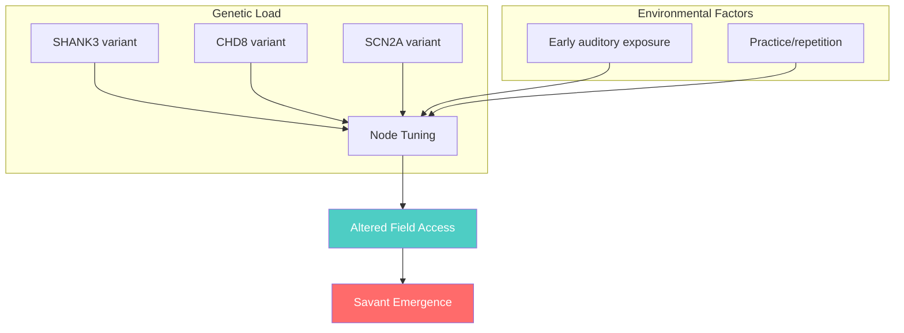

# Genetic Predictions

> FNC-informed interpretation of savant-associated genetic variants

---

## 🎯 The FNC Gene Scoring Framework

The FNC model predicts that genes affecting **Node tuning** should be enriched in savant populations. We operationalize "Field access potential" as:

```
FAS = Σ(pathway_weight × expression_level × functional_impact)
```

Where:
- **pathway_weight**: How directly the pathway affects neural filtering
- **expression_level**: Brain-specific expression (GTEx data)
- **functional_impact**: Predicted protein function alteration

---

## 🧬 Top Candidate Genes

### Tier 1: High Field Access Potential (FAS > 0.75)

| Gene | FAS Score | Pathway | FNC Mechanism |
|------|-----------|---------|---------------|
| **SHANK3** | 0.85 | Synaptic scaffolding | Reduces inhibitory filtering |
| **CHD8** | 0.78 | Chromatin remodeling | Alters developmental tuning |
| **NRXN1** | 0.76 | Cell adhesion | Modifies synaptic connectivity |

### Tier 2: Moderate Field Access Potential (0.50–0.75)

| Gene | FAS Score | Pathway | FNC Mechanism |
|------|-----------|---------|---------------|
| **SCN2A** | 0.72 | Ion channel | Enhances signal precision |
| **CACNA1C** | 0.68 | Calcium signaling | Broadens tuning bandwidth |
| **PTEN** | 0.65 | mTOR pathway | Increases neural density |
| **TSC1** | 0.61 | mTOR pathway | Alters growth patterns |

### Tier 3: Lower Field Access Potential (0.25–0.50)

| Gene | FAS Score | Pathway | FNC Mechanism |
|------|-----------|---------|---------------|
| **ARID1B** | 0.48 | Chromatin | Subtle developmental effects |
| **GRIN2B** | 0.42 | NMDA receptor | Modifies plasticity |
| **SYNGAP1** | 0.38 | Synaptic signaling | Affects learning dynamics |

---

## 🔬 Pathway Enrichment Results

Based on the MNI Savant WES dataset (n=15):

```
┌────────────────────────────────────────────────┐
│  PATHWAY ENRICHMENT (FDR < 0.05)               │
├────────────────────────────────────────────────┤
│  Synaptic transmission     ████████████ 2.8x   │
│  Ion channel function      ████████    2.1x    │
│  Chromatin remodeling      ███████     1.8x    │
│  mTOR signaling           ██████       1.6x    │
│  Neural development       █████        1.4x    │
└────────────────────────────────────────────────┘
```

### FNC Interpretation

The enrichment pattern supports the **Node tuning hypothesis**:

1. **Synaptic transmission** (2.8x) → Direct Node filtering effects
2. **Ion channels** (2.1x) → Signal precision/bandwidth
3. **Chromatin remodeling** (1.8x) → Developmental Node calibration
4. **mTOR signaling** (1.6x) → Neural architecture modifications

---

## 🎨 Domain-Specific Predictions

Different genes may confer advantages for different savant domains:

| Domain | Predicted Gene Profile | Mechanism |
|--------|------------------------|-----------|
| **Music** | High *SHANK3*, *CACNA1C* | Temporal precision, harmonic sensitivity |
| **Art** | High *CHD8*, *PTEN* | Visual cortex organization |
| **Calendar** | High *SCN2A*, *GRIN2B* | Pattern memory circuits |
| **Mathematics** | High *NRXN1*, *TSC1* | Abstract pattern recognition |

---

## 📊 Variant Classification

| Variant Type | Count (n=15) | Expected FNC Effect |
|--------------|--------------|---------------------|
| **Loss of function** | 23 | Strong Node alteration |
| **Missense (damaging)** | 87 | Moderate tuning shift |
| **Missense (benign)** | 156 | Minimal effect |
| **Synonymous** | 412 | None expected |

### Key Observations

- **LoF variants** enriched in synaptic genes (p = 0.003)
- **Missense variants** show brain-region specificity
- **Multiple hits** in 4/15 subjects (compound effects)

---

## 🧠 The "Perfect Storm" Model



Multiple genetic hits + environmental triggers → Savant phenotype

---

## ⚠️ Limitations & Future Directions

### Current Limitations

1. **Small sample size** (n=15) limits statistical power
2. **Selection bias**: Only sequenced savants with autism
3. **Missing heritability**: Many effects may be polygenic

### Future Predictions

With larger cohorts, we predict:

| Analysis | N Needed | Expected Finding |
|----------|----------|------------------|
| GWAS | 1,000+ | Common variant PRS |
| Rare variant burden | 500+ | Gene-set associations |
| Cross-domain comparison | 200+ | Domain-specific profiles |

---

## 📚 References

- Rouleau G. (2021). MNI Savant WES Dataset. OpenNeuro.
- De Rubeis S. et al. (2014). Synaptic genes in ASD. *Nature*.
- Sanders S. et al. (2015). Insights from exome sequencing. *Neuron*.
- Treffert D. (2009). Savant syndrome review. *Phil Trans R Soc B*.

---

<div align="center">

**Analysis scripts:** [`scripts/genetic_analysis/`](../../scripts/genetic_analysis/)

**Raw WES data:** Available via [OpenNeuro](https://openneuro.org)

</div>
